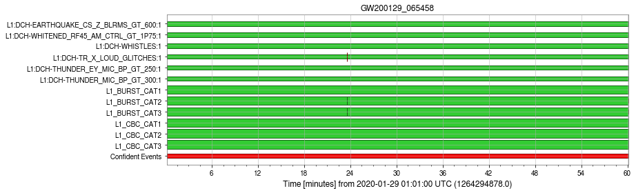
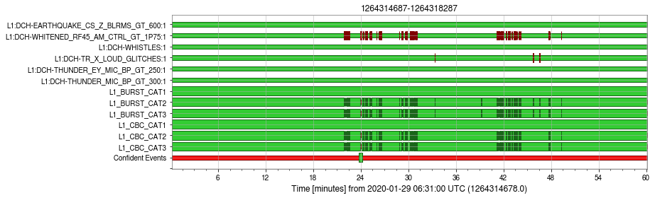
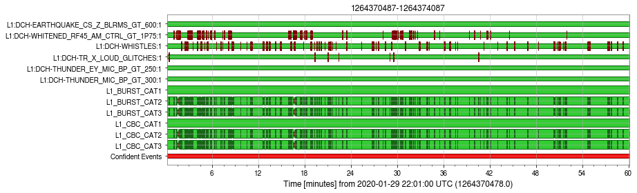

Fractal dimension of the main strain at 16kHz, for 1 second long segments with and without 50% overlap.\
Files also found on CIT at: ***/home/robin.vanderlaag/wp5/strain_fractals/***

# 1264294887 - 1264298487

# 1264314687 - 1264318287

# 1264370487 - 1264374087

